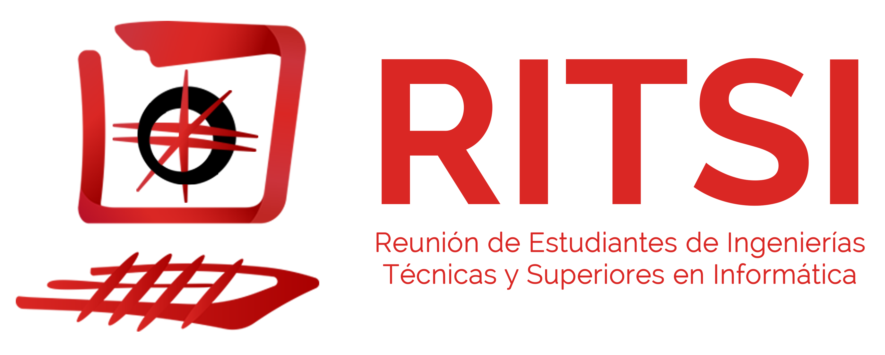

# My Own Media Server

Este repositorio surge a razón de una petición que me hace la [RITSI](https://ritsi.org/) sobre la realizar una formación sobre servidores y su gestión. A lo largo de este repositorio se verá cómo conectar un disco duro en red a nuestro servidor y cómo crear un servidor multimedia con Jellyfin.

El autor de esta formación soy yo, [Jordi S. Enríquez](https://cv.elcontent.es), y la he realizado en base a mis conocimientos y experiencias. Al momento en el que redacto esta web, soy estudiante del Grado en Ingeniería Informática en la Universitat d'Alacant y el actual Coordinador de Infraestructuras y Comunicaciones de la RITSI.

Esta formación se enfoca a que el usuario tenga un primer contacto con la gestión de servidores y la creación de servicios en los mismos. Además, se podrá poner en práctica mediante una Raspberry Pi, aunque no es necesario para la realización de la formación. Para la realización de la formación se utilizará una máquina virtual con Debian 12 (en la Raspberry Pi se usaría Raspberry Pi OS, que se basa en este mismo sistema), aunque se puede utilizar cualquier otra distribución de Linux teniendo en cuenta los cambios que pueda haber.

Pero antes que nada, un poquito de historia:

Debian es un sistema operativo libre desarrollado por miles de voluntarios de todo el mundo que colaboran a través de Internet. Debian se caracteriza por no tener las últimas novedades en GNU/Linux, pero sí tener el sistema operativo más estable posible.

Debian nace en el 1993 de la mano del proyecto Debian, con la intención de crear un sistema GNU con Linux como núcleo. A día de hoy, hay muchos sistemas operativos basados en Debian, como podrían ser Ubuntu, Mint DE o Raspberry Pi OS.

El fundador del proyecto Debian fue Ian Murdock, quien escribió el manifiesto de Debian. En este documento, los puntos más destacables son: mantener la distribución de manera abierta, coherente a la filosofía del núcleo Linux y de GNU.

¿Y de donde viene el nombre? Pues su nombre viene de la combinación del nombre de quien era su pareja y futura esposa, Deborah, con el suyo, Ian, formando el acrónimo Debian.
Finalmente, la primera versión 1.x de Debian fue lanzada en 1996.

Una vez ya conocemos las curiosidades del sistema operativo que tenemos entre manos, ¡vamos al lío! ¡Vamos a [crear nuestra máquina virtual](creando_la_vm.md)! 🚀
