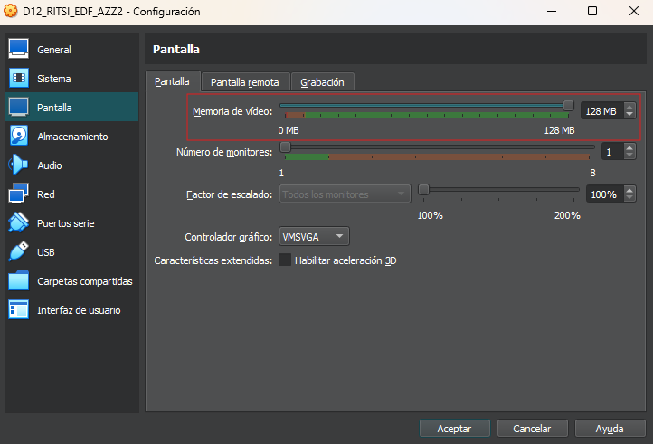

# Creando la máquina virtual

## Descarga de Debian 12

Para la realización de la formación se utilizará una máquina virtual con Debian 12. Para ello, se puede descargar la imagen de la [página oficial de Debian](https://www.debian.org/distrib/netinst). Se recomienda descargar la versión de 64 bits **sin** entorno gráfico.

## Características de la máquina virtual

Para la realización de la formación se recomienda tener una máquina virtual con las siguientes características:
- 4 GB de RAM
- 2 núcleos de CPU
- 20 GB de almacenamiento
- Un disco duro adicional de 20 GB

## Creación y configuración de la máquina virtual - Linux y Windows (VirtualBox)

Es muy importante que una vez tengamos instalado VirtualBox, instalemos las Guest Additions. Las podemos encontrar en la página oficial de VirtualBox, en la sección de descargas con el nombre de "VirtualBox Guest Additions" o "VirtualBox Extension Pack".

Una vez tenemos todo instalado, vamos al lío con la creación de la máquina virtual:

Se nos abrirá una ventana nueva con distintas secciones y opciones. En las capturas de pantalla que siguen en el documento se muestran las secciones que sufren cambios, así como los cambios en sí. **Es muy importante no seleccionar la imagen ISO en estos pasos iniciales hasta que se indique**:

Una vez llegados a este punto, le daremos clic al botón *terminar*.

Ahora veremos nuestra máquina virtual creada en la pantalla inicial de la aplicación, pero no está terminada, ahora nos toca configurarla. Para ello le daremos clic al botón de configuración.

Veremos una pantalla como esta:

¿Qué vamos a hacer en esta configuración? Pues bien, vamos a realizar cambios que permitan que la máquina virtual esté al mismo nivel de red que nuestra máquina host, por lo tanto, tendrá una IP en nuestra red local y será accesible desde cualquier dispositivo que esté conectado a nuestra red local. Por otra parte, vamos a revisar la configuración del portapapeles entre host e invitado y la memoria de vídeo.

Una vez llegados a este punto, podemos dar clic sobre el botón aceptar para que se guarden nuestros cambios.
