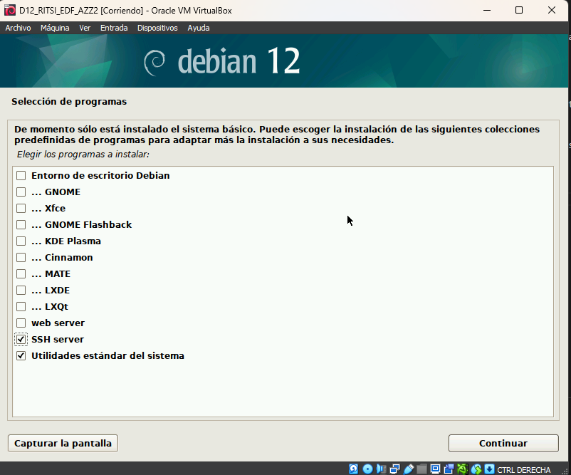
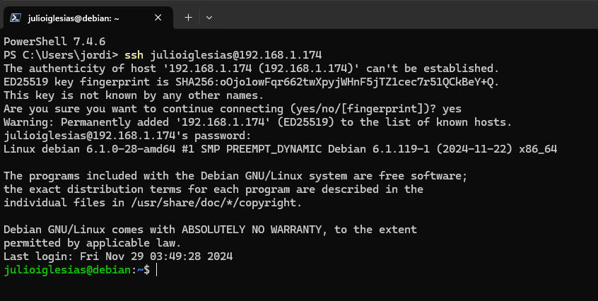
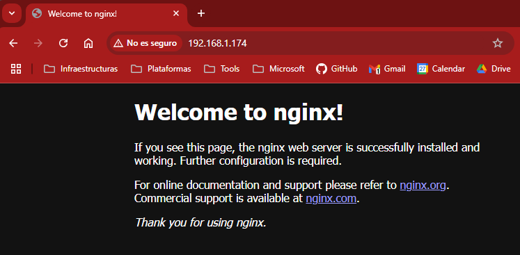

# Instalación de Debian 12

Para la realización de la formación se utilizará una máquina virtual con Debian 12. Para ello, se puede descargar la imagen de la [página oficial de Debian](https://www.debian.org/distrib/netinst). Se recomienda descargar la versión de 64 bits **sin** entorno gráfico. Por otro lado, si nos descargamos un *netinst* (instalador de red), necesitaremos una conexión a Internet para poder instalar el sistema operativo y nos dará la opción de instalar el entorno gráfico que queramos (o no instalar ninguno). En este caso, hemos descargado un *netinst* y no instalaremos ningún entorno gráfico.

Empezaremos la instalación de Debian 12 arrancando la máquina virtual. Lo primero que hará será arrancar el medio de instalación con un menú que nos preguntará el tipo de instalación que queremos hacer. En nuestro caso, vamos a lo más sencillo: **instalación gráfica**.

Como la instalación es prácticamente un *siguiente*, *siguiente*, *siguiente*, sólo voy a mostrar las partes relevantes de la instalación. Y en nuestro caso será la interfaz gráfica del sistema operativo que, como ya sabemos, no hay, puesto que es un servidor:



Una vez llegados al final de la instalación y reiniciada la máquina, nos pedirá que introduzcamos el usuario y la contraseña. Una vez introducidos, ya tendremos nuestra máquina virtual con Debian 12 instalada.


## Añadimos nuestro usuario a sudo

Accedemos a la máquina virtual con nuestro usuario y contraseña y configuramos nuestro usuario. Entramos en el root: 

```bash	
su -
```

Y añadimos nuestro usuario al grupo *sudo*:

```bash
usermod -aG sudo julioiglesias
```

Finalmente, instalamos *sudo*:

```bash
apt update
apt install sudo -y
```

A partir de este momento, podremos ejecutar comandos con privilegios de superusuario. Recuerda salir del usuario root con el comando *exit*. También podemos acceder a la máquina virtual desde *PowerShell* o *CMD* con el comando *ssh*. Para ello, necesitamos la IP de la máquina virtual. Para obtenerla, ejecutamos el comando *ip a* y anotamos la IP que aparece en la interfaz de red que estemos utilizando.

```bash
ssh julioiglesias@IP
```



## Añadimos alias para controlar mejor algunos comandos

Para controlar mejor algunos comandos, vamos a añadir unos alias a nuestro usuario. Para ello, editamos el archivo *.bash\_aliases*:

```bash
echo "alias poweroff='sudo systemctl poweroff'" > echo .bash_aliases
echo "alias reboot='sudo systemctl reboot'" >> echo .bash_aliases
source .bashrc
```

También puedes editarlo con tu editor de texto favorito, como por ejemplo *nano* o *vim*:

```bash
nano .bash_aliases
```

Y añadimos las siguientes líneas:

```bash
alias poweroff='sudo systemctl poweroff'
alias reboot='sudo systemctl reboot'
```

Con esto, podremos apagar y reiniciar la máquina con los comandos *poweroff* y *reboot* respectivamente.

## Instalación de herramientas necesarias

Para la realización de la formación, vamos a necesitar instalar algunas herramientas o, simplemente, nunca viene mal tenerlas. Para ello, ejecutamos el siguiente comando:

```bash
sudo apt install -y neofetch net-tools zip nginx curl wget git
```

Llegados a este punto ya tenemos nuestra máquina virtual con Debian 12 instalada y configurada: 


Además, tenemos instalado un servidor web *nginx* que nos permitirá acceder a la máquina virtual desde cualquier dispositivo de nuestra red local. Para ello, abrimos un navegador web y escribimos la IP de la máquina virtual. En mi caso, la IP es *192.168.1.174*:



El servidor NGINX no lo vamos a utilizar en la formación, pero es interesante tenerlo instalado para futuros proyectos. Aun así, dejaré un reto al final de la formación en el que configuraremos el proxy inverso de NGINX para acceder a Jellyfin desde cualquier dispositivo de nuestra red local.

Con esto finalizamos la creación y configuración de la máquina virtual con Debian 12. 


